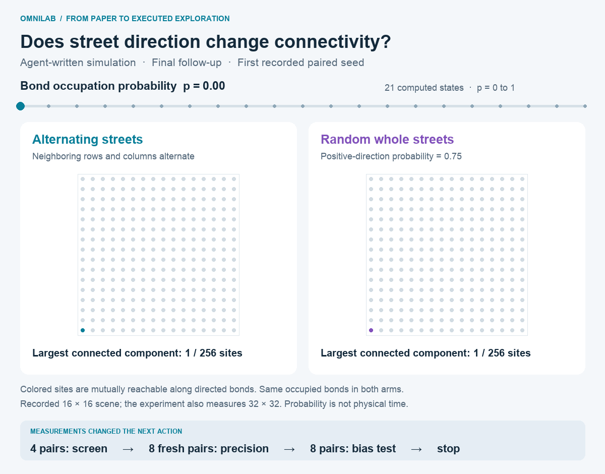

# OmniLab

**From a scientific paper to an experiment you can inspect.** OmniLab uses
Omnigent to coordinate specialists that read evidence, critique research directions,
write simulation code, execute experiments and use the results to choose what
to investigate next.

## Why this project

AI can propose far more experiments than human experts have time to validate.
Generating more ideas is useful only if a scientist can check where an idea came
from, what was actually tested and whether the evidence supports the conclusion.
OmniLab focuses on making that review tractable through two criteria:

1. **Directions grounded in a paper.** Start with the paper's stated follow-up
   directions and open questions, retain the supporting passages, and distinguish
   the authors' suggestions from new agent hypotheses or user-supplied questions.
2. **Claims backed by executable artifacts.** Produce code, explicit parameters,
   seeds, raw measurements and visualizations that a reviewer can inspect and
   replay. A convincing explanation alone is insufficient evidence.

The workflow connects those criteria through a bounded loop:

**Paper → Evidence → Hypothesis → Code → Experiment → Result → Next decision**

Omnigent specialists do the research and implementation. A separate **AnyJev
decision-only model** selects from bounded next actions, such as increasing
precision, running an approved follow-up or stopping. It scores the available
options with zero generated tokens; its weights are not scientific confidence
scores. The supervisor carries out the selected experiment within the remaining
budget. Research therefore produces executed work and recorded outcomes, including
failures and inconclusive results, for a human expert to review.

## Highlight: a paper becomes a percolation exploration

Starting from [*Strongly-connected percolation on directed lattices*,
arXiv:2607.24975v1](https://arxiv.org/abs/2607.24975v1) and a requested full-range
comparison, the agents implemented a test of how street direction affects
connectivity. They wrote both the simulation and the scene-generation code,
compared alternating streets with randomly directed whole streets, and executed
follow-ups selected from the measured results. The paper supplies the evidence;
the seed does not supply a preset experiment or precomputed scientific output.



The animation shows all 21 computed occupation probabilities from the final
directional-bias experiment, using its first preregistered paired seed. Colored
sites form the largest strongly connected component: each can reach the others
along directed bonds. The scene shows a 16×16 lattice; measurements also include
32×32 lattices. This is a probability sweep, not physical motion. A single displayed
realization does not establish the aggregate result.
[Static view](docs/assets/percolation-exploration.png) ·
[Figure provenance and measurements](docs/assets/percolation-exploration.json).

| Executed experiment | What the result changed |
| --- | --- |
| Fair random streets, four paired seeds | An inconclusive comparison triggered eight fresh pairs with unchanged parameters. |
| Fair random streets, eight fresh paired seeds | The meaningful-effect question remained unresolved; the next test changed the street-direction bias. |
| Biased random streets, eight paired seeds | The aggregate fell within the stated practical-equivalence range. The run stopped and proposed a direct biased-versus-fair comparison. |

The final difference was **+0.00375** in mean largest-component fraction, with an
exploratory 95% interval of **[−0.00600, +0.01350]**. That interval lies inside the
predeclared ±0.02 range for the average over sizes and probabilities; it does not
establish equivalence of the full curves. The proposed direct comparison is a
next step, not an experiment already completed.

The saved run took **377.8 seconds**, with nine Omnigent specialist calls, three
AnyJev decisions and 50 simulation jobs, including four pilot jobs. It demonstrates
automatic implementation, execution and result-driven exploration from a supplied
paper and question. These are small computational tests; full paper reproduction,
scientific novelty and real-world validity remain unverified. There is no measured
manual baseline for an acceleration multiplier.
[Recorded validation](docs/two-paper-validation.json).

## Try it

```bash
uv sync --locked
npm ci
npm run dev
```

Open [Discovery overview](http://127.0.0.1:8000/overview). The retained percolation
highlight is `20261004T085900Z-demo-percolation`; earlier completed runs are preserved
outside the exploration list in the [archive record](docs/exploration-retention.json).
New live runs appear normally alongside the retained highlight.
Saved-run inspection needs no new model calls. Run artifacts are local and are
not included in a fresh clone; the embedded visualization is included. For a new
live run, follow **Live Omnigent setup** below.

<details>
<summary><strong>Setup, workflow contracts and operations</strong></summary>

[GitHub repository](https://github.com/thomasxiaoxiao/OmniLab).
The installed package is `omnilab`; launch its built UI with `python -m omnilab`.
The historical `hacknation_databricks` Python import namespace and local checkout
directory remain compatible with saved research archives and existing absolute paths.
Omnigent is the orchestration platform used by OmniLab.

Reproducible research and validation workspace with a React + TypeScript UI,
a FastAPI research service, seed papers and saved evidence. Run `npm ci`,
`uv sync --locked`, then `npm run dev` to open http://127.0.0.1:8000.
See [React UI setup and architecture](docs/react-ui.md). The existing
`/_stcore/health` deployment probe remains compatible; `/health` reports the revision.
The current research scope follows `docs/overall-design.md` and `AGENTS.md`.
`hackthon-instruction.pdf` is the corrected Agentic Scientific Discovery challenge
brief. Omnigent must orchestrate the live discovery workflow; the earlier housing
challenge requirements are superseded.

New UI runs and unconfigured Omnigent CLI runs use the **repository workflow**.
The **Example papers** picker contains exactly two seeds: Percolation and AstroSat.
Open **Your papers** to upload one document or import from arXiv. Intake is shown
directly, with no saved-paper dropdown or automatic selection of previous uploads.
The paper just uploaded or imported becomes the source for the run. Uploads never
extend the example catalog; PCBI and Sulzer are not examples. Content-identical
copies of seeds select the existing
example. In the UI, a validated paper is sufficient to enable **Start bounded run**;
a public GitHub repository is optional. A unique paper link is prefilled. Omnigent
specialists read the source, critique up to three directions,
compare two tests, and generate Python/C from the paper or supplied pinned repository.
Without a repository, the run explicitly records a new paper-based implementation;
it never claims to have executed author code. A supplied repository that fails to
load stops the run, without switching modes.
The supervisor executes it in Omnigent's OS sandbox, validates a baseline sanity
check and deterministic replay. An Omnigent researcher interprets the measurements
and proposes a parameter follow-up; a separate **AnyJev decision-only evaluator**
selects continuation or stop from bounded options. It uses pinned local Qwen3/MLX
logits with zero generated tokens. Its scores are uncalibrated option weights.
No preset scientific kernel is selected
for this path. Historical configurations are readable for audit but cannot launch preset experiments.

Before accepting a comparison, the supervisor executes four feasibility jobs:
baseline, proposed, sanity and exact replay. Failed code is returned to the
experimenter with its sandbox diagnostics for at most two repairs. Each attempt,
its code and failures remain archived and count against the simulation/call budget.
The pilot provides a conservative runtime estimate; it does not guarantee that
every subsequent seed will fit. Full batches retain their own timeout and numerical
checks. All returned measurements and scenes must be deterministic; execution
timing is recorded separately. New user-started runs use their configured finite
time limit; the original event's expired cutoff remains historical context.
When screening is inconclusive, the researcher can propose the preregistered
precision test to AnyJev. If selected and budgeted, it runs more paired samples
with fresh seeds and unchanged baseline/treatment parameters. Earlier samples
are not pooled into the new estimate; intervals remain exploratory.

New plans must identify an unresolved question, explain why the primary outcome
is independent of any target used to construct the treatment, and supply one or
two executable parameter follow-ups. Declared identity/conversion-only plans are
rejected and returned for correction; those calculations belong in sanity checks.
The critic and planner assess scientific informativeness—this structured check is
not an automatic proof that a hypothesis is useful. The researcher considers the
planned follow-ups after each result, and AnyJev retains the final continue/stop
decision. Routine bounded experiments do not require another approval.
The researcher receives each trial's additional measurements, prioritizing numeric
endpoints and compact diagnostics within a fixed context budget. Omitted fields
are disclosed and remain in raw artifacts; omitted quality checks are unverified.
AnyJev receives the assessment and a hash-bound diagnostic handoff, keeping its
own decision context bounded. Audits reconstruct the handoff from the raw results.
New agent “Next experiment” summaries must be one sentence of at most 20 words
and 140 characters; violations receive the bounded contract-repair attempt.
Long historical summaries are shortened only in the overview, with the original
available in an expander and the immutable decision artifact.

**Discovery overview** combines the former overview and final synthesis. It opens
with the simulation, then gives the result, what changed, and the next experiment.
Plans, citations, uncertainty and execution details are expandable below.
Only the newest run for each paper appears by default; **Show previous runs** opens
the history. A finished repository run highlights its final evaluated experiment
once. Intermediate rounds remain in the audit history. Failed or incomplete runs
do not promote partial measurements to final results.

Supported code: offline Python 3.12 using the standard library, NumPy, SciPy, PyEphem 4.2.1 and
repository functions; optional C17 sources compiled as a shared library and called
from Python. Network access and package installation are unavailable inside the
experiment. Source/code directories are read-only; only disposable scratch is
writable. macOS uses Seatbelt and Linux uses bubblewrap, through pinned Omnigent
0.16.0. Missing sandbox support fails closed. macOS has no enforced resident-memory
or per-job process-count cap. See [execution and reproduction details](docs/repository-execution.md)
and the [live validation record](docs/repository-execution-validation.json).

```bash
.venv/bin/research run --paper /path/to/paper.pdf \
  --repository https://github.com/OWNER/REPO --repository-ref COMMIT \
  --output output/research/my-repository-run
.venv/bin/research verify output/research/my-repository-run
.venv/bin/research replay-code output/research/my-repository-run \
  --output output/replays/my-repository-run
```

The configured seed paper remains arXiv:2607.24975v1. Its extracted text has no
GitHub URL. Both the UI and the unconfigured CLI permit a paper-based implementation.
An explicit configuration can require a repository by disabling
`allow_paper_implementation`.
New papers are never silently mapped onto percolation or AstroSat demonstrations.

## Agent-owned simulations and scenes

Seeds supply only the pinned source papers. The reader explores up to three
source-grounded directions; the critic records accepted, rejected and unselected
routes. The planner compares at least two tests and two visualization options,
then explains its choice, state variables, units, what to watch and limitations.
The prompts favor intuitive physical or mechanistic views when the evidence
supports them. They never require invented motion or an attractive outcome.

The experimenter writes both simulation and scene-generation code. Each sandbox
trial can return a `scene` containing actual computed coordinates, geometry and
frames alongside its numerical results. A trusted generic player draws those
recorded states from the first preregistered paired seed. It contains no domain
simulation or paper-specific reconstruction. Raw output, generated code and
all other trials remain auditable. The evaluator sees both measurements and
visualization availability and chooses a parameter follow-up or explains a stop.

Flat and negative results are valid. Missing or invalid scenes remain explicitly
unavailable while valid numerical results proceed to evaluation. No fallback
animation is manufactured. Larger numerical systems are encouraged when they fit
the experiment budget; the agent chooses full scenes or clearly disclosed aggregation
for legibility. Static geometry can be shared across frames. Total sandbox output is
bounded at 32 MB. Scene validation and exact replay establish provenance
and consistency, not correctness of the scientific model.

See the [measured live validation](docs/agent-owned-scenes-validation.json) and
[two-minute demo](docs/agent-owned-scenes-demo.md).

Old preset kernels, recipes and domain adapters have moved to `tests/legacy/` and
are excluded from the wheel. Old workflow configurations are rejected by the live
gateway. Historical archives remain inspectable without rerunning their built-in
visual reconstruction. See [historical descriptions](docs/historical-workflows.md).

## Selecting a new scenario and explaining comparisons

The latest Percolation run is the retained exploration highlight above. The
[two-paper validation demo](docs/two-paper-demo.md) records the earlier Percolation
and AstroSat checks, including the updated archive locations for inspection.

New runs load bounded, hash-checked history for the identical seed paper before
reader, critic and planner selection. `exploration_mode: "new_direction"` is the
default; exact repeated directions are rejected and the critic must assess
substantive overlap. `"replicate"` permits a requested repeat. `history_roots`
(default `output`) can include archived validation directories. The saved
`prior-experiments.json` discloses search bounds and omitted or unreadable records;
it is context for selection, not proof of scientific novelty.

Plans name both methods, explain the changed mechanism and state what is held
constant. The overview also shows the final experiment's actual changed parameters.
The player starts paused at its first computed frame and labels the recorded range.
It never extends a short experiment with manufactured endpoint states.

A requested parameter sweep can be enforced in run configuration, for example
`required_sweep: {"parameter": "probabilities", "label": "Bond occupation probability p",
"lower": 0.0, "upper": 1.0}`. The planner must include both endpoints on an identical,
strictly increasing grid for baseline, proposed and follow-up comparisons. The
sandbox pilot and every accepted batch must return exactly those sample values.
Agents still design and write the simulation and scene code from paper evidence.

## Live Omnigent setup

```bash
uv sync --locked
.venv/bin/research prepare-model  # One-time pinned AnyJev model setup on Apple Silicon
.venv/bin/research configure-agent --auth subscription
# In separate terminals:
bash scripts/research-runtime.sh server
bash scripts/research-runtime.sh host
# Once connected:
bash scripts/research-runtime.sh status
.venv/bin/research run --paper data/papers/2607.24975v1.pdf \
  --config examples/percolation/discovery.json \
  --output output/research/my-agent-run
.venv/bin/research verify output/research/my-agent-run
.venv/bin/research replay-code output/research/my-agent-run \
  --output output/replays/my-agent-run
npm run dev
```

This uses existing `codex login` authentication. Configuration uses the configured
Codex model unless `--model` or `RESEARCH_MODEL` is supplied. The runtime helper
prefers the bundled CLI on macOS; `OMNIGENT_CODEX_PATH` overrides it. Services bind
to loopback and `status` saves connection identifiers in ignored runtime state.
The CLI and UI use Omnigent for research and experiments, and local AnyJev for
evaluation. New live repository configurations require `decision_backend: anyjev`.
Missing inference support, ambiguous choices or exhausted decision budgets stop
cleanly with retained evidence; there is no Codex evaluator fallback. Existing
archives retain their original evaluator provenance. The current local evaluator
requires Apple Silicon and the pinned MLX model.

**Agents & execution loops** shows separate sessions, real handoffs, route choices,
and continuation or stop reasons. It refreshes while work is running, preserving
inspection and form drafts. **Discovery overview** shows the final evaluated
experiment, a guide to what to watch, full interpretation, limitations and next
experiment. Intermediate rounds and unsuccessful routes remain available.

## Optional API-key and Databricks routes

Omnigent 0.16.0 is pinned. For future API usage, set `OPENAI_API_KEY` in your
private environment or `.env`, then configure the SDK harness:

```bash
.venv/bin/research configure-agent --auth api-key --model YOUR_MODEL_ID
# Restart the server and host with the key available in their environment.
```

The generated `agents/local/config.yaml` contains model/profile names, never keys,
and is ignored by Git. The subscription harness excludes `OPENAI_API_KEY` from its
Codex child; switching to API usage is explicit. API-key inference was not exercised.

For an existing Databricks workspace:

```bash
uv sync --locked --extra databricks
.venv/bin/research configure-agent --model YOUR_SERVING_MODEL_ID \
  --databricks-profile YOUR_EXISTING_PROFILE
```

For a remote Omnigent server, set `OMNIGENT_SERVER_URL`, `OMNIGENT_HOST_ID`, and
`OMNIGENT_API_TOKEN` if required. Non-loopback servers must use HTTPS. Each role
gets a new host runner; incomplete requests are interrupted and runner cleanup is
requested on exit. The SDK can also bind an explicitly pre-existing compatible
runner when no host ID is set. `research doctor --spec agents/local` checks the
bundle only; completed streaming responses establish live execution.

Optional MLflow export verifies artifact hashes before logging parameters,
metrics and the run directory. Local export has been exercised; cloud export
requires an authorized workspace and tracking configuration.

```bash
uv sync --locked --extra tracking
mkdir -p .runtime
.venv/bin/research log-mlflow output/research/my-validation \
  --tracking-uri sqlite:///.runtime/research-mlflow.db \
  --experiment research-validation
# For an existing Databricks tracking setup, use --tracking-uri databricks.
```

## Development

Prerequisites: Git, Python 3.12 (uv can install it), uv, Node.js 22 or newer,
and GitHub CLI authenticated with access to this repository.

```bash
uv sync --locked
npm ci
cp .env.example .env
npm run dev
```

Development serves http://127.0.0.1:8000 with reload. The PM2 deployment uses
http://127.0.0.1:8010. Edit `.env` for application settings; credentials, local
datasets, environments, runtime state, and logs are ignored by Git.

```bash
uv add <package>        # Updates pyproject.toml and uv.lock together
uv add --dev <package>
npm run check          # Lint, formatting, tests, and PM2 config syntax
uv run ruff format .
```

Commit `uv.lock` and `package-lock.json`. Use feature branches and pull requests
after the initial bootstrap. CI checks all PRs and pushes to `main`.

## Processes and continuous deployment

```bash
npm start              # Start/restart the app under PM2
npm run status
npm run logs
npm run stop
npm run cd:start       # Start the deployment worker
npm run cd:logs
npm run cd:stop        # Pause automatic deployment; keep app running
npm run deploy         # Check for and deploy the latest main commit once
npm run save           # Save this project's PM2 process list
npm run startup        # Install macOS login service after saving
```

The worker checks `origin/main` every 60 seconds and automatically promotes its
latest commit without waiting for GitHub CI, per the temporary project policy.
CI still runs for visibility. To restore the gate, run
`DEPLOY_REQUIRE_CI=1 npm run cd:start` (and set it for one-off deploys).
The worker exports that commit into a new
`.runtime/releases/` directory, installs its locked production dependencies,
and restarts the app. PM2 must report the expected revision online and the app's
HTTP health check must pass before recording
the release. A failed health check restores the previous release. The deployment
lock prevents overlapping runs. Working files and the development `.venv` are
never reset or reused by deployment.

PM2 runs in `.runtime/pm2`, isolated from other projects. Use the npm commands
above; plain global `pm2 status` addresses a different daemon. Python runs in
fork mode with one worker; restarts can cause a brief interruption.

See [deployment operations](docs/deployment.md) for login startup, configuration,
rollback, and moving to an always-on host.

## Project layout

- `src/hacknation_databricks/`: Python research package, view projections and FastAPI service
- `tests/`: UI and deployment safety checks
- `scripts/`: process and deployment operations
- `.github/`: CI, issue template, and PR template
- `hackthon-instruction.pdf`: supplied challenge brief

The housing-law starter dataset is not part of this research implementation.
Research source intake and all simulations can run independently of cloud setup.

## Source intake and agent visibility

**Source intake** offers exactly two pinned seed examples (Percolation and AstroSat).
**Your papers** opens upload/import directly and has no saved-paper selector.
Upload a PDF or Markdown document and choose **Use uploaded paper**, or import an
arXiv paper. The current session retains that source when switching collections;
previously saved documents are never automatically selected.
The UI accepts an
optional public GitHub repository and revision; a validated upload can start without one. New runs use separate Omnigent reader,
critic/literature, planner, experimenter and result-assessment sessions. A separate
AnyJev evaluator selects the final next action and saves its inputs, options,
weights and handoff in the same run. Starting a run
opens **Agents & execution loops** and follows that exact run.

**Discovery overview** explains what to watch before the recorded simulation,
followed by the measured result, what changed, and the next action. The former **Final synthesis** entry has been removed.
**Generated artifacts** retains the paper, pinned source archive, generated code,
parameters, seeds, measurements, prompts and handoffs. Inspecting a saved run makes
no model or experiment calls. Older sealed runs retain their original provenance
and scientific limitations; the app does not rerun preset visual reconstruction.

</details>
