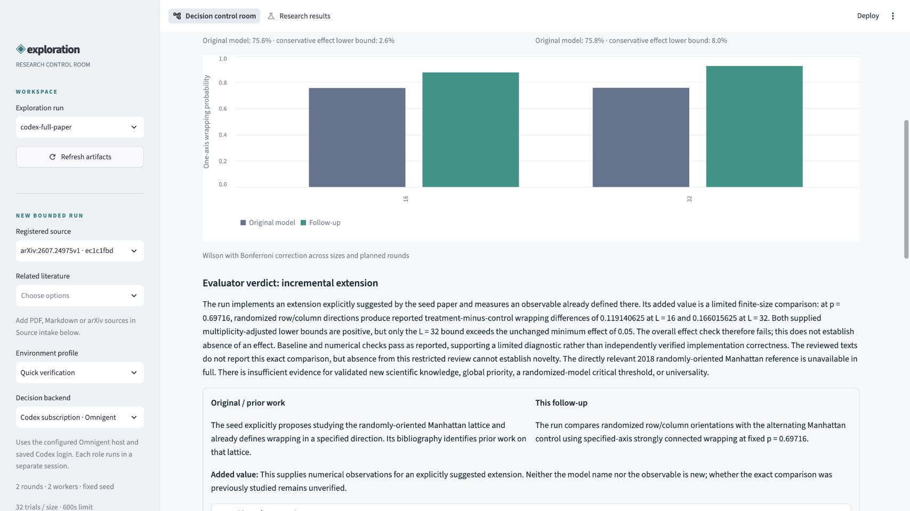

# Codex subscription: verified live research run

On October 3, 2026, the full-paper workflow completed with `--backend omnigent`,
Omnigent 0.16.0 and the ChatGPT-bundled Codex CLI 0.160.0. `codex login status`
reported ChatGPT authentication. The configured model was the user's existing
`gpt-6-astra`, with medium reasoning for the research roles. No API key was needed,
created, copied into the repository, or printed.

The run is `output/research/codex-full-paper`. Its status is `review_complete`.
Six independent Omnigent sessions produced real schema-valid model responses:
reader, critic, literature reviewer, planner, validator, and novelty evaluator.
Their saved session IDs, raw responses and timestamps establish execution;
spec loading and mocked tests are separate checks. The session API reported
`usage: null`, so token counts and monetary cost are unknown, not zero.

## Measured result

The baseline ran Manhattan, L-lattice and random-diode models at sizes 16 and 32,
with 512 trials per cell. All six consistency checks passed the predeclared
finite-size tolerance. The randomized-Manhattan follow-up ran another 512 trials
per size: **4,096 trials plus eight seed replays**, with no replay failures.

| Size | Original Manhattan | Randomized Manhattan | Difference | Conservative effect lower bound |
| --- | ---: | ---: | ---: | ---: |
| 16 | 75.59% | 87.50% | +11.91 pp | 2.57 pp |
| 32 | 75.78% | 92.38% | +16.60 pp | 7.97 pp |

The predeclared criterion requires a lower bound of at least five percentage
points at **both** sizes. It did not pass. The evaluator returned
`incremental_extension`: useful finite-size measurements of a direction explicitly
suggested by the original paper, without evidence of global novelty, critical
thresholds or universality. These are small-lattice consistency checks, not the
paper's high-precision reproduction.



## Automated reference review

The retriever scans explicit arXiv citations, resolves versions, downloads bounded
PDFs, verifies their text and hashes, and records every retrieval outcome.

| Source | Outcome |
| --- | --- |
| Seed: 2607.24975v1 | Full 16-page paper supplied to the reader and evaluator |
| 2605.16987v1 | Full 11-page reference reviewed |
| 2512.10566v1 | Full 5-page reference reviewed |
| 2412.20781v1 | Downloaded; 45 pages excluded by the combined context budget |

The evaluator must cite exact page-local quotations from **every supplied source**.
Unknown IDs, fabricated quotes and omitted source evidence fail validation. Its
comparison separates original work, this follow-up and added value. A claimed
candidate contribution also needs the numerical and literature gates to pass.
There is no mandatory human approval step.

Coverage is bounded: the directly relevant Ledger–Tóth–Valkó 2018 reference has
no explicit arXiv identifier in the seed and was not retrieved. The evaluator
flags this gap. It reviews summaries and deterministic check results, not the
entire raw trial file or an independent execution of the code; those artifacts
remain available for further verification. An unavailable source never becomes
evidence that no prior work exists.

## Verification

`npm run check` passed lint, formatting, **132 tests** and PM2 syntax validation.
Artifact hashes and the decision ledger pass verification. Tests cover host-runner
launch, subscription/API bundle separation, citation fabrication, bounded
reference retrieval, evaluator evidence and both UI modes. A browser check confirmed
the real saved result, chart, evaluator verdict and reference cards.

## Reproduce and inspect

```bash
uv sync --locked
.venv/bin/research configure-agent --auth subscription
# Separate terminals, leave both running:
bash scripts/research-runtime.sh server
bash scripts/research-runtime.sh host
# Working terminal:
bash scripts/research-runtime.sh status
.venv/bin/research run --backend omnigent \
  --config examples/percolation/codex-live.json \
  --output output/research/new-codex-run
.venv/bin/research verify output/research/new-codex-run
npm run dev
```

For the exact saved reference versions, replace automatic retrieval with
`--no-auto-literature --literature data/literature/2605.16987v1.pdf
--literature data/literature/2512.10566v1.pdf`. Numerical trials are reproducible
from recorded seeds; live model language and decisions can vary.

Open **codex-full-paper → Original vs follow-up** in the control room. The
**Agents & loops** tab shows the six sessions and their inputs and outputs.
The cached demo needs no model call. A portable measured-result snapshot is in
`examples/percolation/codex-results/`; the complete source, code and trial archive
remains in the ignored run directory. Both have SHA-256 manifests.

API-key configuration remains available with
`research configure-agent --auth api-key --model YOUR_MODEL_ID` and a private
`OPENAI_API_KEY` in the server/host environment. This uses the SDK harness and is
separate from subscription usage. It was configuration-tested, not live-tested.
See [OpenAI authentication](https://learn.chatgpt.com/docs/auth) and
[non-interactive authentication](https://learn.chatgpt.com/docs/non-interactive-mode).

The local demo is a development preview. No public deployment, organizer score,
recording or hackathon submission is claimed.
